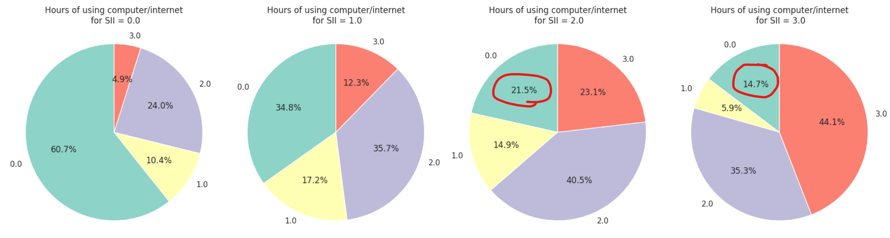

# Questioning the Statement

## Are we really simplifying the process? 
Data collection for the model involves professional assessments, questionnaires and specialised equipment, adding complexity rather than simplifying the process for families.

## Are we using the future to predict the past?

The "relative_date_PCIAT" field in the actigraphy data is defined as the "number of days (integer) since the PCIAT test was administered (negative days indicate that the actigraphy data was collected before the test was administered)."

Only 59 actigraphy files contain data with relative_date_PCIAT < 0, whereas most of the files have some data with relative_date_PCIAT > 0.

This indicates that data collected after the Severity Impairment Index (SII) was observed is being used. In other words, future data is being used to predict past events.

Deploying a model trained on such predictors in a real-world setting could be problematic.

## Is a PIU Prediction Model Redundant with Internet Use as an Input?
Problematic Internet use (PIU) is defined as the use of the Internet that creates psychological, social, school and/or work difficulties in a person's life.

So you can't have PIU without excessive Internet use and without health or social problems. 
I wonder what exactly is the need for a Severity Impairment Index (SII) prediction model that relies on features such as "Internet usage" (hours spent online per day)? 
If we need to collect internet usage and health-related data to make predictions, then we're already measuring what we're trying to predict.

In practical terms:

- **Patients with high Internet use and health problems**: We can already suspect problematic Internet use without needing a model, and include in the treatment plan not only medications for the health condition(s), but also recommendations for reducing Internet use and healthy lifestyles.

- **Patients with health problems but low Internet use**: We can infer that their health problems have other causes and focus on diagnosing and treating them, again without the help of the model. Similarly, patients with low physical activity and unhealthy lifestyles need advice on both.

Self-reported Internet use can be inaccurate, but without additional characteristics related to Internet use to train a model, we can't properly diagnose PIU. 

Furthermore, associations found between Internet use and health problems do not prove causation. The root cause might be poor health leading to increased internet use rather than the internet use causing health problems.

## Is the Dataset Really Useful?

The problem statement says that the goal is "to detect early indicators of problematic Internet and technology use."

Given that, PIU reflect the negative consequences of Internet use (when Internet use begins to cause problems), it seems logical to study early signs of PIU in a population of participants who use the Internet more than average. 
This would mean recognizing subtle shifts in behavior, physical activity, or psychological well-being that could signal the onset of problematic internet use before it leads to significant impairment.

However, the dataset has significant limitations:
- **40% of the participants were not affected by Internet use**
- **31% were not assessed**
- **Only ~10% are moderately to severely impaired** (307 participants scored 0 on all PCIAT questions)
- **38.5% of the participants in the training dataset use the internet less than an hour a day**
- A notable proportion of participants with high SII scores use the internet less than an hour a day (**21.55% with SII = 2**, moderately impaired by problematic internet use, and **14.7% with SII = 3**, severely impaired)

If the index is intended to measure problematic internet use, it shouldn’t produce high scores for participants who spend so little time online.  
This raises questions about investigator bias, unreliable self-reporting, or data collection errors. 
Including such a large proportion of people who spend so little time online when the goal is to detect early signs of harmful internet usage is questionable.

Internet usage data should not be used as a feature for this task, but rather as a condition that participants must meet in order to be included in the study. 
This way, we could develop a model to predict whether these individuals show signs of impairment and how severe that impairment is. This would be more consistent with the goals of detecting problematic Internet use.

## Biased data of an unreliable questionnaire

The PCIAT questionnaire (used to derive the SII) appears designed to measure the emotional and social impacts associated with internet use (emotional dependence on the internet, social isolation, neglect of responsibilities, and the impact of internet use on relationships and mood). 
However, parents' perceptions are naturally biased and influenced by various factors such as their own internet habits, cultural attitudes, or their expectations about how their children should behave.

Can spending less than an hour a day online lead to problems such as emotional distress, neglect of duties, or withdrawal from family? It's unlikely. 
The presence of this in the data suggests respondents are not being honest in answering the PCIAT questions, or SII scores are being influenced by factors unrelated to PIU.

Adolescence is a time of identity formation, evolving peer relationships, and a search for independence, which can amplify behaviors like mood swings, disobedience, and impulsivity. 
Consequently, the SII may be capturing these broader developmental behaviors rather than internet use specifically.

Additionally, The applicability of the questionnaire across the age range is questionable. For example:
- A 5-7-year-old may not have household chores, as this depends on cultural norms.
- The question about academic impact may not apply to younger children who are not yet in school or graduated adults.
- Email use and receiving phone calls from "online friends" seem out of context for young children too.
- Questions about reaction to the time allowed to spend on the internet (there are at least 3 of them) are not applicable to adults.

Questions not applicable to a participant’s age could lead to skewed or irrelevant responses. All of these challenges the construct validity of SII and considers whether it accurately measures PIU or is affected by other behavioral factors.