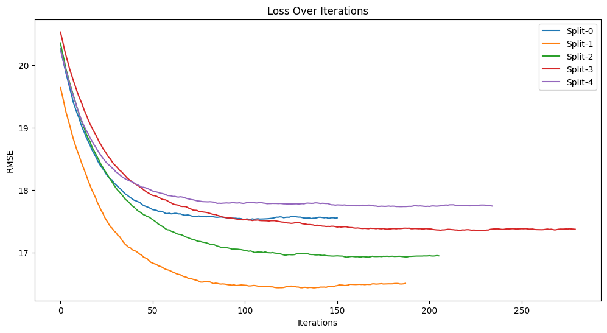
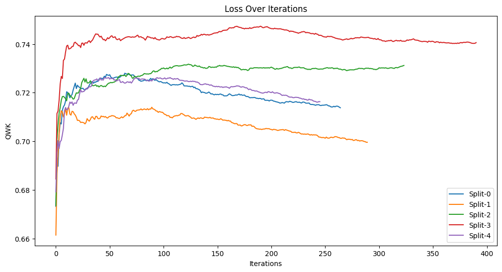
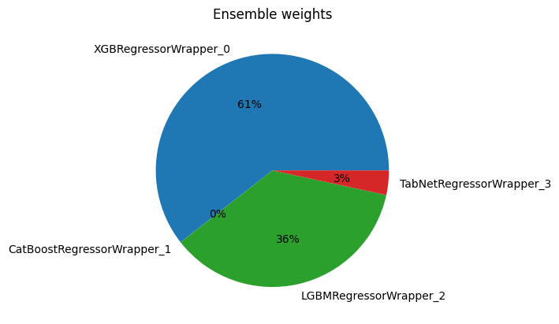
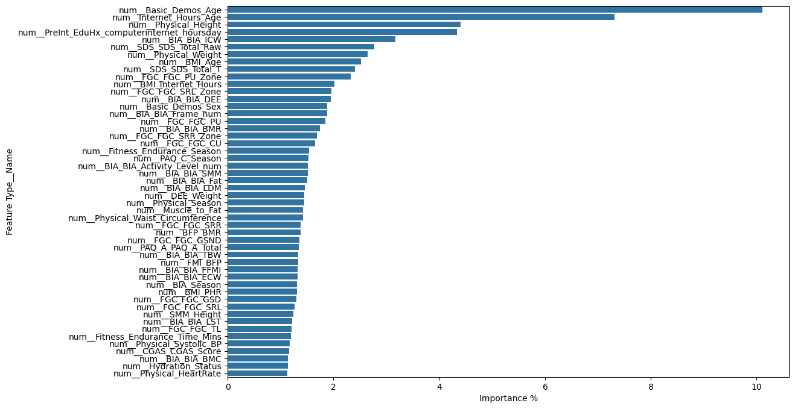

    

        
    

    

        &nbsp;&nbsp;&nbsp;
         &nbsp;&nbsp;
        
         
    

    <h1>Predicting Problematic Internet Use</h1>

In today’s digital age, problematic internet use among children and adolescents is a growing concern.
Better understanding this issue is crucial for addressing mental health problems such as depression and anxiety.
Identifying these patterns can help trigger prompt interventions aimed at promoting healthier digital habits.

## 🎯 **Problem Statement**

Current methods for measuring problematic internet use in children and adolescents are often complex and require
professional
assessments, creating access, cultural, and linguistic barriers for many families.
This project, aims to predict the level of problematic internet usage exhibited by children and adolescents, based on
their physical activity.
The objective is to predict a participant's Severity Impairment Index (sii), a standard measure of problematic internet
use.
By developing a predictive model, we seek to identify early signs of problematic internet use, which can help trigger
interventions to encourage healthier digital habits among youth.

## 🤔 **Questioning the statement**
I'm pretty skeptical on the real impact of this research, see `QUESTIONING_THE_STATEMENT.md` for more details.

## 📊 **Dataset Description**

The dataset used is derived from the Healthy Brain Network (HBN), a clinical sample of about five-thousand 5-22
year-olds who have undergone both clinical and research screenings. 
The data includes:

- **Physical activity data** (wrist-worn accelerometer data, fitness assessments, and questionnaires)
- **Internet usage behavior data**

The training data comprises 3,960 records of children and young people with 81 columns (not including the ID column).

The data is provided in two formats:

- **Parquet files** containing the accelerometer (actigraphy) series
- **CSV files** containing the remaining tabular data

### 📁 **Synthetic Dataset**

A synthetic dataset mirroring the original data's structure and distribution is provided for demonstration purposes.
Access it at `resources/synthetic_dataset.csv`.

### 📜 **Dataset Columns**

The training data comprises measurements from a variety of instruments.
The fields within each instrument are described in `resources/data_dictionary.csv`. 
These instruments are:

- **`Demographics`**: Information about age and sex of participants.
- **`Internet Use`**: Number of hours of using computer/internet per day.
- **`Children's Global Assessment Scale`**: Numeric scale used by mental health clinicians to rate the general
  functioning of youths under the age of 18.
- **`Physical Measures`**: Collection of blood pressure, heart rate, height, weight and waist, and hip measurements.
- **`FitnessGram Vitals and Treadmill`**: Measurements of cardiovascular fitness assessed using the NHANES treadmill
  protocol.
- **`FitnessGram Child`**: Health related physical fitness assessment measuring five different parameters including
  aerobic capacity, muscular strength, muscular endurance, flexibility, and body composition.
- **`Bio-electric Impedance Analysis`**: Measure of key body composition elements, including BMI, fat, muscle, and water
  content.
- **`Physical Activity Questionnaire`**: Information about children's participation in vigorous activities over the last
  7 days.
- **`Sleep Disturbance Scale`**: Scale to categorize sleep disorders in children.
- **`Actigraphy`**: Objective measure of ecological physical activity through a research-grade biotracker.
- **`Parent-Child Internet Addiction Test`**: 20-item scale that measures characteristics and behaviors associated with
  compulsive use of the Internet including compulsivity, escapism, and dependency.

Note in particular the field `PCIAT-PCIAT_Total`, the sum of scores from the Parent-Child Internet Addiction Test. 
Parent-Child Internet Addiction Test (PCIAT): contains 20 items (`PCIAT-PCIAT_01` to `PCIAT-PCIAT_20`), each assessing a different aspect of a child's behavior related to internet use. 
The items are answered on a scale (from 0 to 5), and the total score provides an indication of the severity of internet addiction.

Target Variable (`sii`) is defined as:

- `0`: **None** (`PCIAT-PCIAT_Total` from 0 to 30)
- `1`: **Mild** (`PCIAT-PCIAT_Total` from 31 to 49)
- `2`: **Moderate** (`PCIAT-PCIAT_Total` from 50 to 79)
- `3`: **Severe** (`PCIAT-PCIAT_Total` 80 and more)

This makes `sii` an ordinal categorical variable with four levels, where the order of categories is meaningful.

## 📝 **Results**

The competition results and feature importance analysis validate my initial concerns about the problem statement,
leaving little more to be discussed on the matter. 
The training on the other hand yielded some interesting results: 
As previously stated, the `sii` categorical target is derived from the `PCIAT-PCIAT_Total` KPI, this poses the
opportunity to modify the statement into a regression problem and calculate sii afterward. 
Using this approach boosted the final QWK score by 0.08, compared to a simple classification solution.
Diversifying and ensembling models also helped to stabilize outliers.

### 🏆 **Competition Result**

The model was tested against an unseen set of data, and scored QWK 0.444
on [this](https://www.kaggle.com/competitions/child-mind-institute-problematic-internet-use) competition. 
This performance is just 0.057 QWK away from the top solution in terms of accuracy.

### 📉 **Cross validation Loss Graph**

Cross validation PCIAT RMSE loss shows an accuracy of ~17.1952 over 5 folds, with an acceptable tollerance of ±1 RMSE.
This yields a stable QWK of 0.439.

QWK loss graph of the simple classification solution on the other hand is much less stable and prone to overtraining.

### ⚖️ **Ensembling**

Ensemble RMSE is slightly worse than a single XGB model, but still greatly helps stabilizing model outputs, yelding an
increased QWK score on unseen data.

| model_name               | accuracy  | iterations |
|:-------------------------|:---------:|:-----------|
| XGBRegressorWrapper      | 17.117496 | 190        |
| LGBMRegressorWrapper     | 17.156238 | 118        |
| CatBoostRegressorWrapper | 17.181546 | 269        |
| TabNetRegressorWrapper   | 19.156289 | 83         |

### 🌟 **Feature Importance**

The feature importance graph highlights the most influential factors in predicting problematic internet use. This allows
us to identify key contributors and understand which variables have the most significant impact on our model's
predictions.
